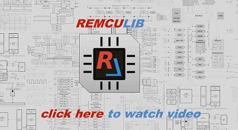

# REMCU examples

Samples illustrating application development on the [**REMCU Lib**](https://remotemcu.com/).

	
 Short demo
		<b>(click here to view) </b>

stm32f4_discovery/accell_graph demo:  
  

stm32f4_discovery/CAN_BUS demo:  

stm32f4_discovery/jupyter-notebook PWM demo:  
  

stm32f4_discovery/jupyter-notebook ADC demo:  

The [**REMCU Lib**](https://remotemcu.com/) is a cross-platform library designed for remote access to internal peripherals of various MCU and SoC as if these peripherals were a part of your computer.
The library gives access a user space program to all peripherals of the remote chip  through the same API as peripheral drivers from Software Development Kit (SDK) provided by semiconductor chip vendors or third parties for MCU firmware development.
Thereby a developer doesn’t need to learn new tools but can just reuse his firmware code and examples of the SDK in his code designed for personal or embedded computers.
Firmware and protocol communication development are not required, because the [**REMCU Lib**](https://remotemcu.com/) translates itself the local API function call on computer to the call of the same function of peripheral driver on the remote chip.

Let's have a look at the video below and see what opportunities and applications it provides.

Full details of the examples can be found in README.md file of the corresponding folders.

## Support policy

If you discover a problem with any of the samples published here that isn't already reported in Issues, open a New issue.

If you have a feature idea - please open a [feature request](https://github.com/remotemcu/remcu_examples/issues).  
If you have new sample development on the REMCU Lib  - please opening a [pull request](https://github.com/remotemcu/remcu_examples/issues) with *"New Sample!"* tag.  
We will be pleased to answer all your questions about the REMCU Lib project through the options/channels below:  
*StackOverflow*. Tag your question with **#remculib** tag. We watch full list of questions and will answer ASAP. Make experience that you've got available for other users!  
[Contact us form](https://remotemcu.com/contact-us)  
[@Email](support@remotemcu.com)  
[Twitter](https://twitter.com/RemoteMcu)  

Thanks in advance!
