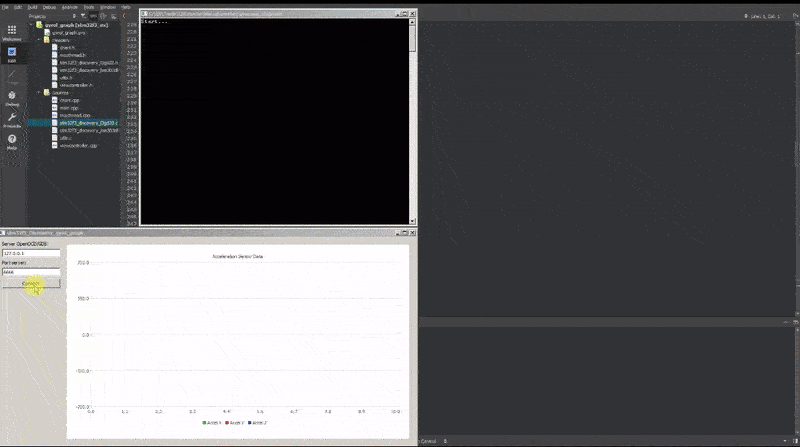
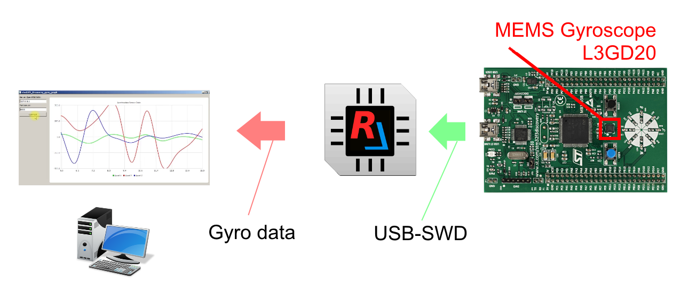
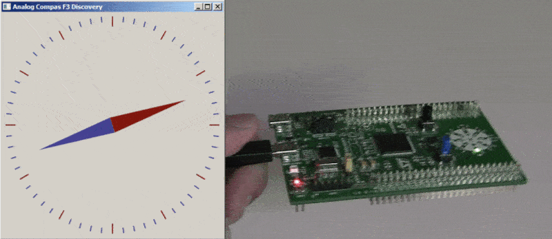

## Overview
There are two examples:  
1. The **gyrol_graph** app grabs gyroscope data from on-board([STM32F3Discovery](https://www.st.com/resource/en/user_manual/dm00063382-discovery-kit-with-stm32f303vc-mcu-stmicroelectronics.pdf)) MEMS *L3GD20* 3-axis digital output sensor and plot graph of it vs. time in real time.

  
functional block diagram <b>(click here to see)</b>

  

2. The **compass** app grabs digital magnetic data from on-board([STM32F3Discovery](https://www.st.com/resource/en/user_manual/dm00063382-discovery-kit-with-stm32f303vc-mcu-stmicroelectronics.pdf)) *MEMS LSM303DLHC* E-compass sensor and shows pointer/needle showing the direction of magnetic north in real time.

  
functional block diagram <b>(click here to see )</b>

  

