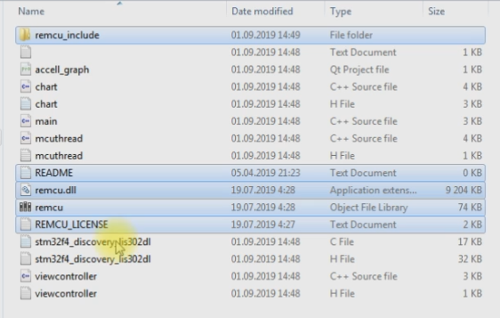
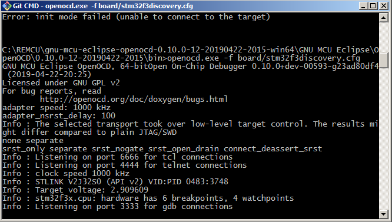
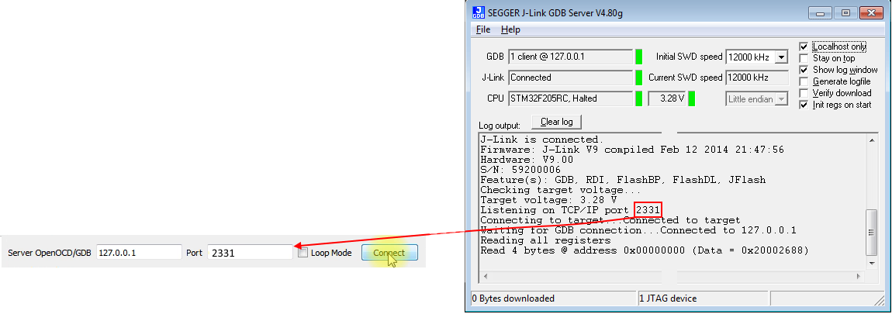

# Plotter of Acceleration

## Overview
The **accell_graph** app grabs acceleration data from on-board([STM32F3Discovery](https://www.st.com/resource/en/user_manual/dm00063382-discovery-kit-with-stm32f303vc-mcu-stmicroelectronics.pdf)) *MEMS LSM303DLHC* sensor and plot graph of it vs. time in real time.
We didn’t load any specific firmware into the microcontroller. Our program just works directly with the I2C peripheral block of the STM32 MCU using a remote procedure execution of the [Standard Peripheral Library](https://www.st.com/en/embedded-software/stm32-standard-peripheral-libraries.html) with help [**REMCU Library**](https://remotemcu.com/). In this way, our application can interact with the accelerometer integrated into the discovery board.


It is just like communicating with the sensor with the help of a USB-I2C convertor. In this case, the STM32F303 chip is the USB-I2C converter. But unlike a highly specialized converter, a microcontroller has great potential and rich number of peripherals.


To interact with a microcontroller hardware from our PC we use the driver functions of [STM32F3-Discovery_FW_V1.1.0](https://www.st.com/en/embedded-software/stm32-standard-peripheral-libraries.html) of STMicroelectronics company. It is a vendor software development kit provided by STMicroelectronics company for a firmware development of STM32 MCU.
Our application calls these driver functions, just like calls them for hardware operations from firmware code.

The code controlling I2C peripheral module have been taken from **MEMS**([main.c](STM32F3-Discovery_FW_V1.1.0/Project/Demonstration/main.c)) example of [Standard Peripheral Library(SPL) for STM32F3Discovery](https://www.st.com/content/st_com/en/products/embedded-software/mcu-mpu-embedded-software/stm32-embedded-software/stm32-standard-peripheral-library-expansion/stsw-stm32118.html). You can see description of SPL examples at [UM1565](https://www.st.com/resource/en/user_manual/dm00062956-description-of-stm32f37xx38xx-standard-peripheral-library-stmicroelectronics.pdf) doc.

## Installation and Use
### Project prerequirements
To run the example next software is required:

  * PC with MacOS or Linux(Ubuntu recommended) or Windows OS
  * An [STM32F3Discovery](https://www.st.com/en/evaluation-tools/STM32F3Discovery.html) board
  * [Qt Framework](https://www.qt.io/download-open-source)
>Note: QT framework is only required to build and run the example. The REMCU lib is a simple dynamic library. It does not depend on the QT frameworks and the QT Creator. You can add the REMCU library to other IDEs and frameworks
  * [Qt Creator](https://www.qt.io/download-open-source)
  * [Qt Charts](https://doc.qt.io/qt-5/qtcharts-overview.html) component
  * MSVC2015(or later) toolchain or MinGW 7.3(or later) for Windows OS.
  * Debug server. It can be an OpenOCD([prebuild package](https://github.com/ilg-archived/openocd/releases/tag/v0.10.0-12-20190422)) or st-link GDB server from [Atollic TrueStudio](https://atollic.com/truestudio/) or [Jlink GDB server](https://www.segger.com/products/debug-probes/j-link/tools/j-link-gdb-server/about-j-link-gdb-server/) (if you use jlink instead of st-link)

### Prepare
Download the example. Download the necessary version of REMCU Lib from [**download page**](https://remotemcu.com/download):  
Target - **STM32F3Discovery**  
Library - **StdPeriph_Lib**  
Version - **1.1.0**  
Operation system - **your OS**
<details>
  <summary>download show<b>(click here) </b></summary>
  

</details>
fExtract the library to examples the folder (accel_graph folder). Open the **accell_graph** project with help Qt Creator and build it. Run compiled app.
<details>
  <summary>show <b>(click here)</b></summary>
  

</details>

Connect the Discovery board to your PC, then

#### If you want to use OpenOCD

Run OpenOCD with arguments above:

Macos/Linux:
```bash 
openocd.exe -f board/STM32F3Discovery.cfg
```
<details>
  <summary>
Success output of console <b>(click here) </b></summary>


</details>

#### If you want to use st-link GDB server
Install [Atollic TrueStudio](https://atollic.com/truestudio/).
Go to ***TrueSTUDIO for STM32 9.3.0\Servers\ST-LINK_gdbserver*** and run **ST-Link_GDB_server.bat** script

<details>
  <summary>Success output of console <b>(click here) </b></summary>


</details>

Type this port number to text field of the app:
<details>
  <summary> ST-Link GDB port <b>(click here) </b></summary>


</details>

#### If you want to use Jlink debugger
<details>
  <summary>jlink with F4Discovery <b>(click here)</b></summary>
  

</details>

To run the Jlink utility, you use [Segger guide](https://www.segger.com/downloads/jlink/UM08001)
<details>
  <summary> Jlink window <b>(click here)</b></summary>
  

</details>

####  Running the accell_graph app
Just run application. If you have non-default openocd configuration or other server you type the port number and IP that be used the server to the text fields of the app 
<details>
  <summary> Jlink port <b>(click here)</b></summary>


</details>

Press ***Connect*** Button. The app plots graph of accel. You can rotate the Discovery board and watch this:
<details>
  <summary>Demonstration <b>(click here) </b></summary>
  

</details>
