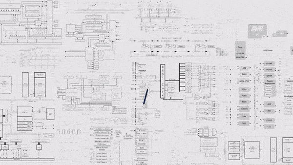
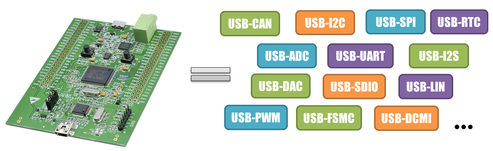
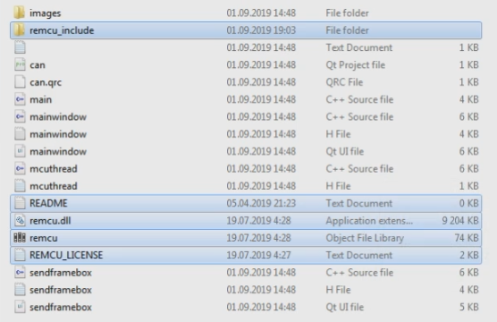
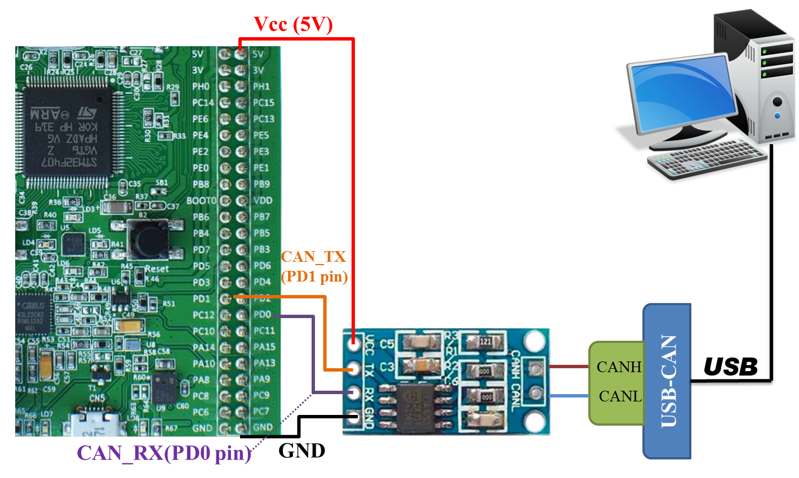
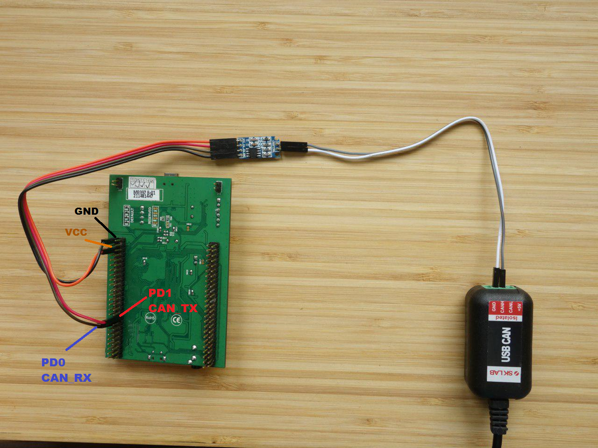
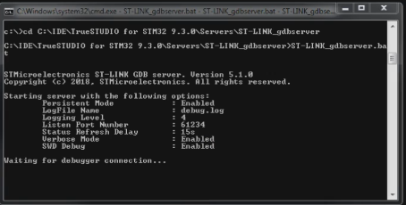
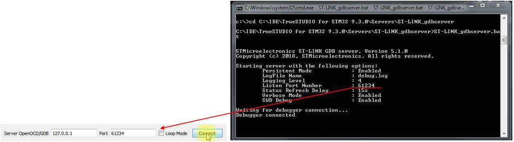

# CAN Bus sniffer app

## Overview
This example covers a [CAN Bus](https://en.wikipedia.org/wiki/CAN_bus) peripheral module. It is a GUI app of almost full-featured CAN bus analyzer.
We didn’t load any specific firmware into the microcontroller. Our program just works directly with the CAN peripheral block of the STM32 MCU using a remote procedure execution of the [Standard Peripheral Library](https://www.st.com/en/embedded-software/stm32-standard-peripheral-libraries.html) with help [**REMCU Library**](https://remotemcu.com/). In this way, our application can interact with CAN devices connected to the Discovery board.



It is just like communicating with the sensor with the help of a USB-CAN convertor. In this case, the STM32F407 chip is the USB-CAN converter. But unlike a highly specialized converter, a microcontroller has great potential and rich number of peripherals.



To interact with a microcontroller hardware from our PC we use the driver functions of [Standard Peripheral Library](https://www.st.com/en/embedded-software/stm32-standard-peripheral-libraries.html) of STMicroelectronics company. It is a vendor software development kit provided by STMicroelectronics company for a firmware development of STM32 MCU.
Our application calls these driver functions, just like calls them for hardware operations from firmware code.

The code controlling CAN peripheral module have been taken from **CAN_Networking**([main.c](../STM32F4-Discovery_FW_V1.1.0/Project/Peripheral_Examples/CAN_Networking/main.c)) example of [Standard Peripheral Library(SPL) for STM32F4DISCOVERY](https://www.st.com/content/st_com/en/products/embedded-software/mcu-mpu-embedded-software/stm32-embedded-software/stm32-standard-peripheral-library-expansion/stsw-stm32068.html#overview)


## Installation and Use
### Project prerequirements
To run the example next software is required:

  * An [STM32F4DISCOVERY](https://www.st.com/en/evaluation-tools/stm32f4discovery.html) board or another STM32F407 board with a debugger.
  * PC with MacOS or Linux(Ubuntu recommended) or Windows OS.
  * [Qt Framework](https://www.qt.io/download-open-source)
>Note: QT framework is only required to build and run the example. The REMCU lib is a simple dynamic library. It does not depend on the QT frameworks and the QT Creator. You can add the REMCU library to other IDEs and frameworks
  * [Qt Creator](https://www.qt.io/download-open-source)
  * MSVC2015 (or later) toolchain or MinGW 7.3 (or later) for Windows OS.
  * Debug server. It can be an OpenOCD(**We recommend this [prebuild package](https://github.com/ilg-archived/openocd/releases/tag/v0.10.0-12-20190422)**)
>Other OpenOCD versions can have an incompatibility with this REMCU Library version. For instance, [v0.10.0-13](https://github.com/xpack-dev-tools/openocd-xpack/releases/tag/v0.10.0-13) version has another TCL server API and you can not use remcu_connect2OpenOCD function in REMCU Library for connecting to OpenOCD TCL server(default 6666 port). Only remcu_connect2GDB function for connecting OpenOCD GDB server (default 3333 port). or st-link GDB server from [Atollic TrueStudio](https://atollic.com/truestudio/) or [Jlink GDB server](https://www.segger.com/products/debug-probes/j-link/tools/j-link-gdb-server/about-j-link-gdb-server/) (if you use jlink instead of st-link)
  * A CAN transeiver like TJA1050 or others.
  * A USB-CAN converter with PC software for testing. We use a [SL-USB-10.1](http://www.mcutool.ru/products/interfaces/can/slusb101.aspx) device
 with a [SLCANView](http://www.mcutool.ru/helps/slcanview/default.htm) app.
  * Some wires to build CAN bus between the devices.

### Prepare
Download the example. Download the necessary version of REMCU Lib from [**download page**](https://remotemcu.com/download):  
Target - **STM32F4DISCOVERY**  
Library - **StdPeriph_Lib**  
Version - **1.1.0**  
Operation system - **your OS**
<details>
  <summary>download show<b>(click here) </b></summary>
  

</details>
Extract the library to this folder. Open the **CAN_BUS** project with help Qt Creator and build it. Run compiled app.
<details>
  <summary>show <b>(click here)</b></summary>
  

</details>

Connect the Discovery board to your PC, then

Build a CAN network using this diagram:
<details>
  <summary>scheme <b>(click here) </b></summary>
  
  
  
  
</details>

#### If you want to use OpenOCD

Run OpenOCD with arguments above:

Macos/Linux:
```bash 
./openocd -f board/stm32f4discovery.cfg
```
Windows:
```bash 
openocd.exe -f board/stm32f4discovery.cfg
```
<details>
  <summary>
Success output of console <b>(click here) </b></summary>


</details>

#### If you want to use st-link GDB server
Install [Atollic TrueStudio](https://atollic.com/truestudio/).
Go to ***TrueSTUDIO for STM32 9.3.0\Servers\ST-LINK_gdbserver*** and run **ST-Link_GDB_server.bat** script

<details>
  <summary>Success output of console <b>(click here) </b></summary>


</details>

Type this port number to text field of the app:
<details>
  <summary> ST-Link GDB port <b>(click here) </b></summary>


</details>

#### If you want to use Jlink debugger
<details>
  <summary>jlink with F4Discovery <b>(click here)</b></summary>
  

</details>
To run the Jlink utility, you use [Segger guide](https://www.segger.com/downloads/jlink/UM08001)
<details>
  <summary> Jlink window <b>(click here)</b></summary>
  

</details>
Type this port number to text field of the app like in st-link gdb case above
<details>
  <summary> Jlink port <b>(click here)</b></summary>


</details>

Run the special application for working with your CAN-USB adapter. Set baud rates to 125 kbit/s and start to monitor CAN bus.

### Running...

Press **Connect** Button of the example app. The app is ready  to receive and transmit CAN messages. Type some CAN message (ID and payload) and press **SEND** button. The USB_CAN adapter has received the message:

<details>
  <summary> show <b> (click here) </b></summary>
  

</details>
Check a receiving of messages. Send some CAN packaet from your PC to Discovery board

<details>
  <summary> show  <b> (click here) </b></summary>
  

</details>


