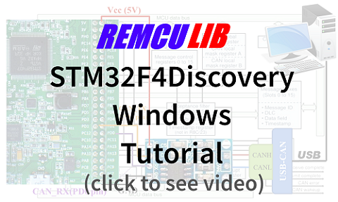
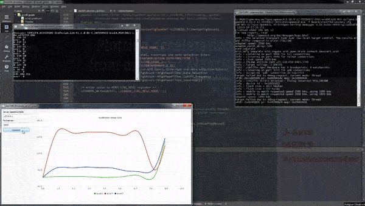

# STM32F4Discovery Examples

A video tutorials on how to build and run these examples:

## accell_graph
It is a GUI app which grabs acceleration data from on-board(STM32F4Discovery) MEMS sensor and plot graph of it vs. time in real time.  

  
demo
<b>(click here)</b>

## CAN_BUS
It is a GUI app of [CAN Bus](https://en.wikipedia.org/wiki/CAN_bus) sniffer based on STM32F4Discovery board.

  
demo
<b>(click here)</b>

## jupyter-notebook
There are scripts for [Jupyter Notebook](https://jupyter.org/) IDE. The Python script contains work with GPIO and Timer PWM. The C++ script (Cling Interpreter) contains works with GPIO, Timer, ADC, DMA, DAC modules.  

  
demo
<b>(click here)</b>

  

## STM32F4-Discovery_FW_V1.1.0
[Standard Peripheral Library(SPL) for STM32F4DISCOVERY](https://www.st.com/content/st_com/en/products/embedded-software/mcu-mpu-embedded-software/stm32-embedded-software/stm32-standard-peripheral-library-expansion/stsw-stm32068.html#overview) with a description of SPL samples([AN3983](https://www.st.com/content/ccc/resource/technical/document/application_note/f1/6d/73/bb/50/a5/47/17/DM00038796.pdf/files/DM00038796.pdf/jcr:content/translations/en.DM00038796.pdf) doc). All the code controlling STM32F4 peripherals in examples above have been taken from there.

