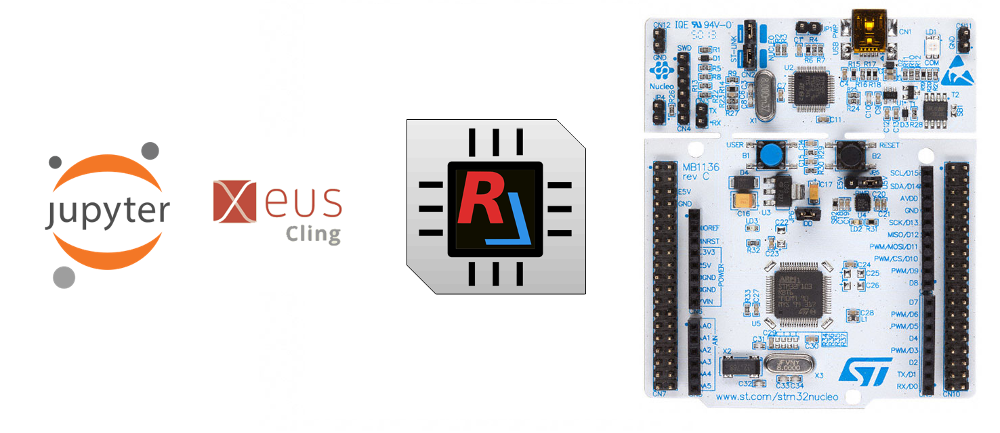
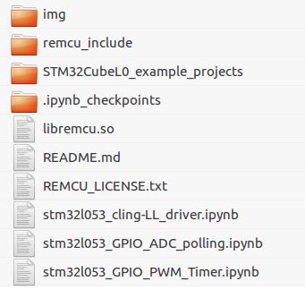
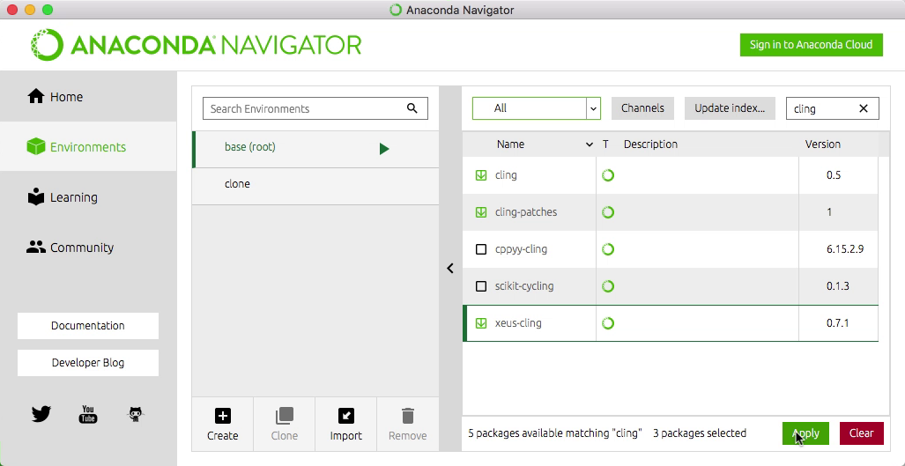
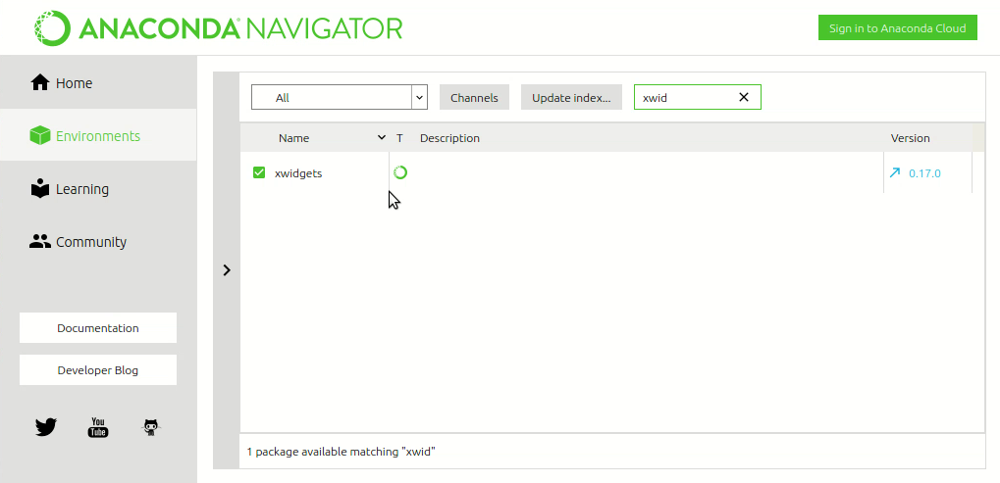
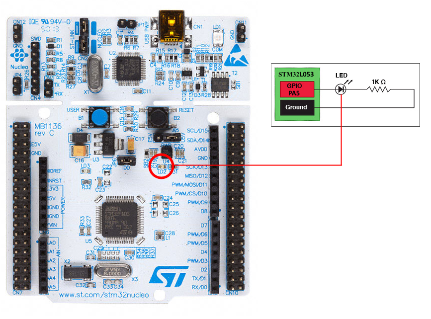
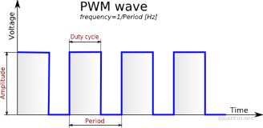
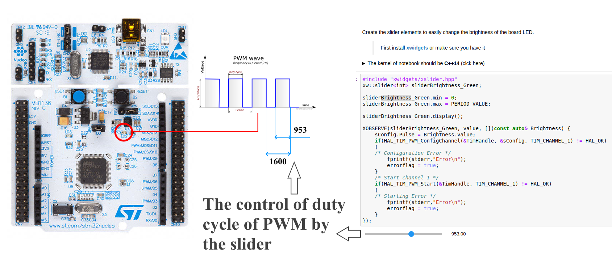
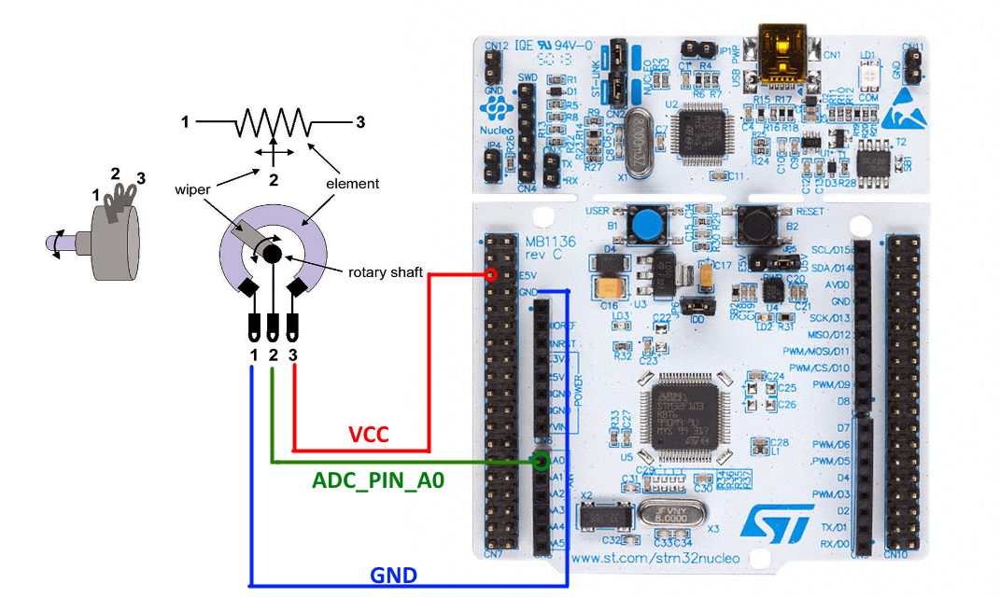
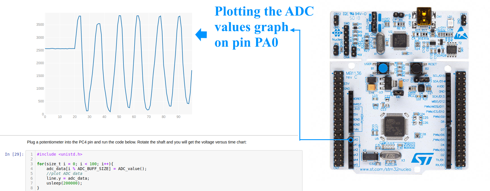

# Jupyter Notebook Examples for STM32L053Nucleo Board

## Overview
If you ever wish to conduct a quick experiment with any chip peripheral module or explore it, then [**REMCU Lib**](https://remotemcu.com/) is the right tool for that. It can be easily integrated in [Jupyter Notebook](https://jupyter.org/) with an Interactive C++ interpreter . This IDE is free and it lets you run and execute C or C++ code on the go. This way you can call the functions of a driver directly and control MCU or SoC in real time.  
It saves a lot of time that is usually spent on the development of experimental MCU firmware. An interact work with MCU/SoC peripherals helps us to explore new peripheral blocks of MCU/SoC quicker.  
And furthermore, the application code written in the C programming language using REMCU is backwards-portable, meaning it can be transferred from a desktop program to the MCU program and vice-versa. The code will work just as fine on MCU as it works on PC. That's why code written on desktop with ReMCU can be used to develop stand-alone firmware for MCU.  
There is also possible to use the REMCU with high level languages like Python, Java, C# and others.  To make working with them less troublesome, we provide language wrappers. With these wrappers it becomes easy to work with hardware as it is using C or C++.

*These examples demonstrates how to easily use REMCU Lib with C++ ([Cling](https://github.com/root-project/cling)) interpreter and Python interpreter*

## Prerequirements
  * An [STM32L053Nucleo Board](https://www.st.com/en/evaluation-tools/nucleo-l053r8.html) board
  * PC with MacOS or Linux(Ubuntu recommended)
  * [Anaconda Distribution](https://www.anaconda.com/distribution/), ***we recommend Python 2 version***
  * A debug server. It can be an OpenOCD(**We recommend this [prebuild package](https://github.com/ilg-archived/openocd/releases/tag/v0.10.0-12-20190422)**)
>Other OpenOCD versions can have an incompatibility with this REMCU Library version. For instance, [v0.10.0-13](https://github.com/xpack-dev-tools/openocd-xpack/releases/tag/v0.10.0-13) version has another TCL server API and you can not use remcu_connect2OpenOCD function in REMCU Library for connecting to OpenOCD TCL server(default 6666 port). Only remcu_connect2GDB function for connecting OpenOCD GDB server (default 3333 port).

## Prepare

Install the [Anaconda Distribution](https://www.anaconda.com/distribution/) 

Download the example. Download the necessary version of REMCU Lib from [**download page**](https://remotemcu.com/download):  
Target - **STM32L053**  
Library - **HAL and Ll Driver**  
Version - **V1.11.2**  
Operation system - **your OS**

Extract the library to this folder. 

  
show <b>(click here)</b>

  

Connect the Discovery board to your PC, then

## C++ scripts/notebooks
C++ [Cling](https://github.com/root-project/cling) interpreter is only available for Unix-like system (***MacOS*** and ***Linux***). Run Anaconda Navigator and install [**xeus-cling**](https://github.com/jupyter-xeus/xeus-cling), [**xwidgets**](https://github.com/jupyter-xeus/xwidgets) and [**xplot**](https://github.com/QuantStack/xplot) packages.  

  
xeus install show
<b>(click here) </b>

Run Jupyter Notebook and open the stm32l053_GPIO_PWM_Timer.ipynb and stm32l053_GPIO_ADC_polling.ipynb notebook files in that. The script contains detailed comments for work. You just do step by step code of the script and observe the results.

### GPIO Example

>The code below have been taken from **IO_Toggle** ([main.c](STM32CubeL0_example_projects/NUCLEO-L053R8/Examples/GPIO/GPIO_IOToggle/Src/main.c)) example of [STM32L0 HAL and Low Layer drivers](https://www.st.com/resource/en/user_manual/dm00113898-description-of-stm32l0-hal-and-low-layer-drivers-stmicroelectronics.pdf)  
This sample toogles the LED2 on the nucleo board.

### PWM example

This example shows how to configure the TIM peripheral in PWM (Pulse Width Modulation) mode.
>The code below have been based on **TIM_PWM_Output** ([main.c](STM32CubeL0_example_projects/NUCLEO-L053R8/Examples/TIM/TIM_PWMOutput/Src/main.c)) example of [STM32L0 HAL and Low Layer drivers](https://www.st.com/resource/en/user_manual/dm00113898-description-of-stm32l0-hal-and-low-layer-drivers-stmicroelectronics.pdf)

With [**xwidgets**](https://github.com/jupyter-xeus/xwidgets) library you can create the interactive slider widget that controls brightness of LED2.

### ADC example

>The code below is based on **ADC_RegularConversion_Polling** ([main.c](STM32CubeL0_example_projects/NUCLEO-L053R8/Examples/ADC/ADC_RegularConversion_Polling/Src/main.c)) example of [STM32L0 HAL and Low Layer drivers](https://www.st.com/resource/en/user_manual/dm00113898-description-of-stm32l0-hal-and-low-layer-drivers-stmicroelectronics.pdf)

With [**xplot**](https://github.com/QuantStack/xplot) library you can plot the graph of ADC values on PA0 pin

Description of REMCU functions can be found can be found in [API reference](https://remotemcu.com/api-v1-0)  
Code controlling MCU peripherals have been taken from examples of [STM32L0 HAL and Low Layer drivers](https://www.st.com/resource/en/user_manual/dm00113898-description-of-stm32l0-hal-and-low-layer-drivers-stmicroelectronics.pdf). 

