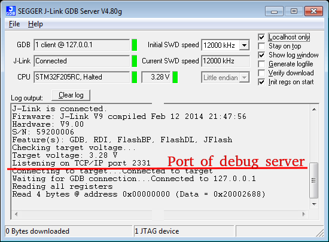
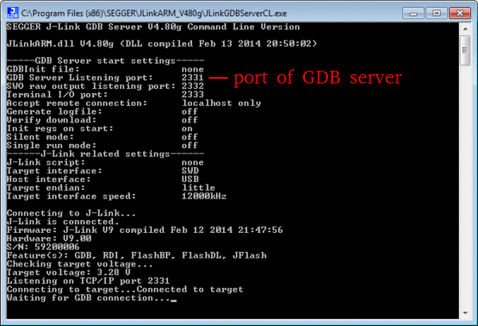
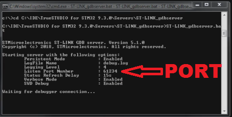

# API 1.0 of REMCU Lib

## Functions:

### remcu_connect2OpenOCD
```C
bool remcu_connect2OpenOCD(const char* host, const uint16_t port,
                      const int timeout_sec);
```  
The function is used to create a connection to the OpenOCD server destination.  
*param*:  
**host** - ip address of OpenOCD server "XXX.XXX.XXX.XXX". If the server runs on the host machine, the argument should be "localhost" or "127.0.0.1" value.  
**port** - port of OpenOCD server. Default is 6666  
**timeout_sec** - This parameter specifies the length of time, in seconds,
 to wait for a response when establishing communications. It can not be negative!  
*return*: If no error occurs, function returns **true**


### remcu_connect2GDB
```C
bool remcu_connect2GDB(const char* host, const uint16_t port,
                       const int timeout_sec);
```  
The function is used to create a connection to the GDB server destination  
*param*:  
**host** - ip address of GDB server "XXX.XXX.XXX.XXX". If the server runs on the host machine, the argument should be "localhost" or "127.0.0.1" value.  
**port** - port of GDB server. Default is 3333.  For instance, st-link GDB server and J-link GDB server print the port in log messages.  
<details>
  <summary><b> Jlink windows </b></summary>
  


</details>  
<details>
  <summary><b> ST link GDB windows </b></summary>
  

</details>
 You can get it from there.  
**timeout_sec** - This parameter specifies the length of time, in seconds,
 to wait for a response when establishing communications. It can not be negative!  
*return*: If no error occurs, function returns **true**

### remcu_disconnect
```C
bool remcu_disconnect();
```  
Closes the connection to the debug server(OpenOCD or GDB).  
*return* **true** only if an existing connection was successfully closed.

### remcu_isConnected
```C
bool remcu_isConnected();
```  
The function returns true if an attempt to connect is successful.

### remcu_getVersion
```C
const char * remcu_getVersion();
```  
The function returns verson of REMCU lib. ***Don't free the pointer after use!***

### remcu_resetRemoteUnit
```C
bool remcu_resetRemoteUnit(const enum ResetType type);
```  
The function performs a reset of remote target(MCU or SoC)  
*params* **type**: the parameter specifies what should happen after the reset
> __RUN (enum value 0) Let the target run  
  __HALT (enum value 1) Immediately halt the target

### remcu_setVerboseLevel
```C
void remcu_setVerboseLevel(const enum LevelDebug level);
```  
The function sets the verbose level. There are several levels of verboseness one can choose from.  
*params* **level**
> level __ERROR (enum value 0) is almost silent, producing only necessary messages  
level __WARNING (enum value 1) is good for most purposes, where as.  
level __INFO (enum value 2) is good when developing a new pipeline.  
level __DEBUG (enum value 3) is good for debugging, especially when getting un-expected results.

### remcu_getErrorCount
```C
size_t remcu_getErrorCount();
```  
The fucntion returns the qty of errors that occurred during the last operations after start or call remcu_clearErrorCount.

### remcu_clearErrorCount
```C
void remcu_clearErrorCount();
```  
The function clear the counter of errors in the function above.

### remcu_debuggerTest
```C
const char* remcu_debuggerTest();
```  
Some of debug adapters can have hardware problems. The function enables to detect such adapters. The function returns a null pointer if the test is successful. ***Don't free the pointer after use!***


### remcu_store2mem
```C
bool remcu_store2mem(const uintptr_t addr, const uint8_t* src, const size_t count);
```  
Copies count bytes from the remote MCU memory to by RAM address to the object pointed to by dest.  
*params*:  
 **addr** - RAM MCU address to copy from. Example: it may be 0x20000000 for ARM cortex M* core.  
 **count** - number of bytes to copy. The param has to be no more than ***32*** bytes(for Education and Community version).   
 **dest** - pointer to the memory location to copy to.  
 *Return*: If no error occurs, function returns true.


### remcu_loadFrMem
```C
bool remcu_loadFrMem(const uintptr_t addr, const size_t count, uint8_t* dest);
```  
The function copies count bytes from the remote MCU memory to by RAM address to the object pointed to by dest.
*params*: 
**addr** - RAM MCU address to copy from. Example: it may be 0x20000000 for ARM cortex M* core.  
**count** - number of bytes to copy. The param has to be no more than ***32*** bytes(for Education and Community version).  
**dest** - pointer to the memory location to copy to.  
*return*: If no error occurs, function returns true

